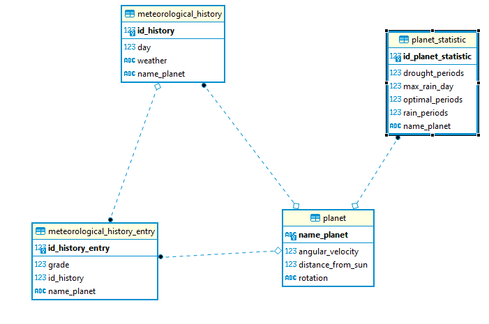
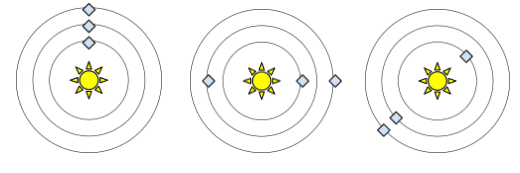
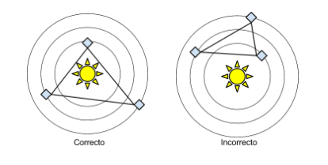
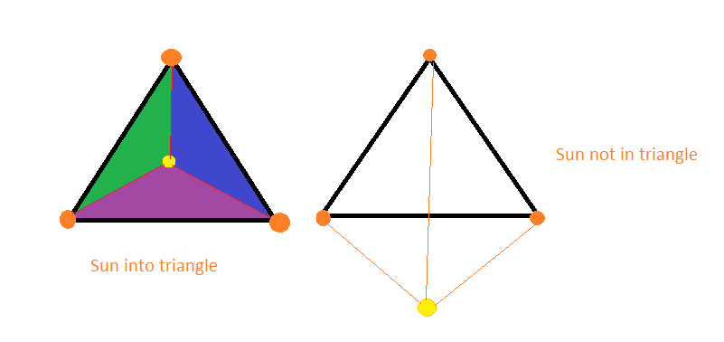
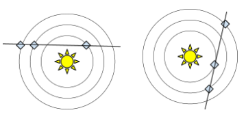

# Weather Predictor
Weather predictor API that provides the weather information of the civilizations registered in the system.
The information provides by the API is generated based on a simulation made by the system, taking into account the parameters of each civilization and the parameter specified in the system (like the number of years to simulate and the initial position of each planet in the galaxy).

## Documentation

* [Data Model Diagram](#data-model-diagram)
* [Solution approaches for each weather condition](#solution-approaches-for-each-weather-condition)
    - [Approaches 1. Drought weather](#approaches-1-drought-weather)
    - [Approaches 2. Rain weather (three planets)](#approaches-1-drought-weather)
    - [Approaches 3. Optimal weather](#approaches-3-optimal-weather)
* [Development requirements](#development-requirements)
* [Authors](#authors)
* [Running the application locally](#running-the-application-locally)
* [License](#license)


## Data Model Diagram


The data model  was made to support more than three civilizations and with the capability to store multiple weather data of all the planets registered in the model; for that reason, the table meteorological_history has an FK with the planet. After all, the system can have stored a set of meteorological history per each planet, and additionally, we store in the meteorological_history_entry the information of the configuration of the planets given a day, and is different per planets because one day in one planet is different to the others because the angular velocity could be different in all planets.

## Solution approaches for each weather condition

The purpose of the system is to calculate the weather of a specific day, given a specific galaxy configuration

### Approaches 1. Drought weather



Drought weather is generated when all planets of the galaxy are collinear, including the sun, and the proposed solution to find this case was to select the angular position of a random planet and compare if all other planets have the same angular position or the opposite position of the angular reference position (-180 or +180).

### Approaches 2. Rain weather (three planets)



Rainy weather is generated when all galaxy planets create a triangle, and the sun is into the triangle. The proposed solution to find this case was to calculate the area of the triangle formed by the planets and compare it with the sum of the areas of the alternative triangles formed between all pairs of planets and the sun(0,0), for these operations was necessary to transform the given polar coordinates of the planet (grade and distance) to cartesian coordinates (x and y) taking the sun as a reference point (0,0)

If the comparison is accurate, it means that the sun is in the triangle. If the sun is not in the triangle, the sum of the triangle areas will be more principal than the original triangle.



### Approaches 3. Optimal weather



Optimal weather is generated when all planets of the galaxy are collinear, without including the sun. The proposed solution to find this case was to calculate the slope of one planet vs. the other planets. If the slope of all planets concerning the chosen planet is the same but different from the slope concerning the sun, the Weather is Optimal.

## Development requirements

For building and running the application you need:

- [JDK 1.11](https://openjdk.java.net/projects/jdk/11/l)
- Maven (Included as wrapper)
- postgresql data base 

## API Documentation

The documentation of the API was generated using Swagger2, and could be access through the domain http://{domain-name}}/api/swagger-ui.html#/

## Authors
- [Rosemberg Porras](https://github.com/rosemberg-12)

## Running the application locally

There are several ways to run a Spring Boot application on your local machine. One way is to execute the `main` method in the `co.rosemberg.weatherpredictor.WeatherPredictorApplication.java` class from your IDE.

Alternatively you can use gradle wrapper to run the application

```shell
./mvnw spring-boot:run
```

## License
[GPL](https://openjdk.java.net/legal/gplv2+ce.html)